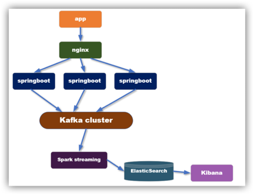

It's a realtime user behavior analysis project to string together many components of the Hadoop Ecosystem. 

## Introduction

There is a program to fake tons of user behaviors(click items, collect items, add coupon, buy) from different location via different devices. It's in the gmall1205-mock component

Then I have a logserver to collect these user data and send them to Kafka, based on the high-throughput, low-latency features of Kafka, data can be in near real time be transformed to downstream server, that is sparkstreaming, it will do the business logic: calculate DAU, transaction amount, detect abuse behavior etc., then the results will be saved to Hbase and Elasticsearch for further query.

## system structure:

- **gmall1205-mock**: mock data from apps installed on mobiles, and web on PC

- **gmall1205-logger**: build a logserver cluster (springboot framework) to collect user logs

- nginx (load balancer before logserver cluster) to balance requets

- logserver sends data to kafka(high throughout, fast, so it can buffer the data)

- **gmall1205-realtime**: uses sparkstreaming to consume kafka and does the business logic（calculate daily and timesharing DAU, transaction amount etc）

  - user login data comes from Kafka and is used for calculating DAU
  - transaction amount is calculated based on data coming from Canal that monitors mysql changes(order, order_detail, user, product etc)
    - Canal is an open source product provided by Alibaba Group. Canal can parse incremental log data in MySQL and allows you to subscribe to and consume incremental data.

  - while calculating DAU, because user can login multiple times a day, there need **redis** to remove duplicates，

  - then data is saved to HBase for persistent storage

  - analysing user behavior logs using sparkstreaming to generate abuse coupons alert(ex. check in every 5min window, more than 3 users add coupons in a device without viewing) and saved to ES

  - to get user purchase details, I also join streaming order data and streaming order_detail data together, joining streaming data is kind of difficult here, they may not arrive at the same time, so there needs to cache the data in redis for either order or order_details which arrives first, then wait for the next stream, then look up the whole user table and complement user info of the order

- **gmall1205-publisher** provides APIs for query dau and purchase behavior details.

- **dw-chart**: in kiana, we can draw many charts to show user purchase behavior info
